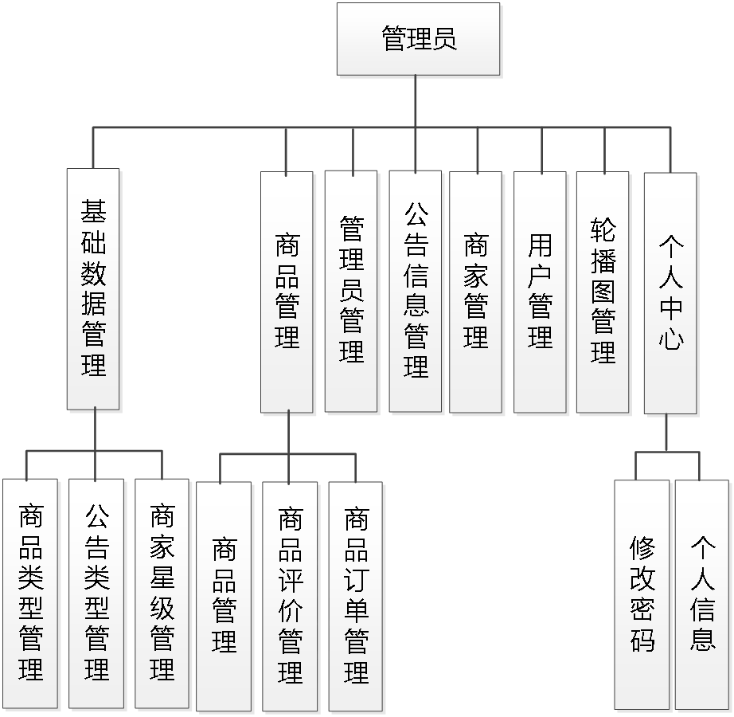
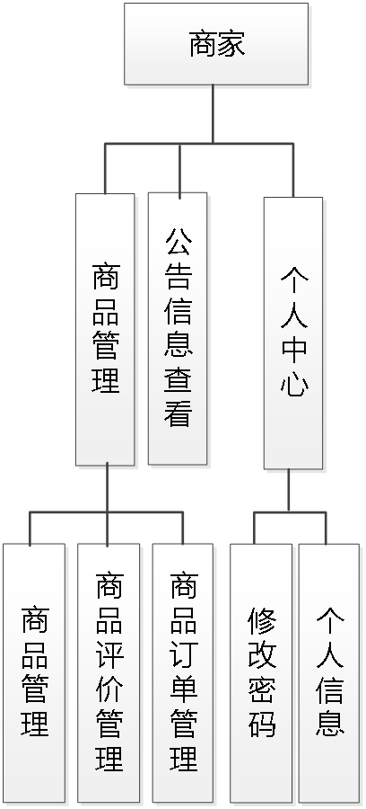
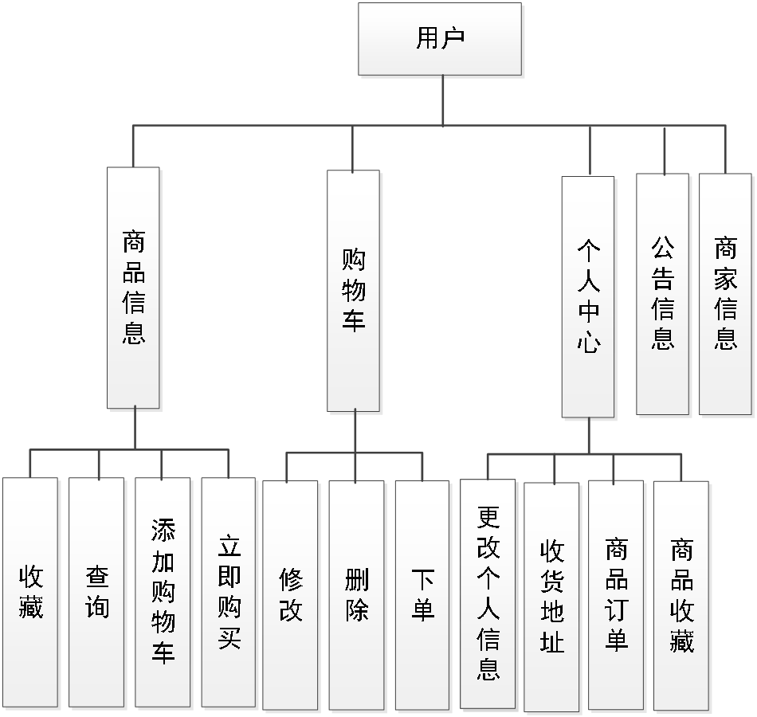
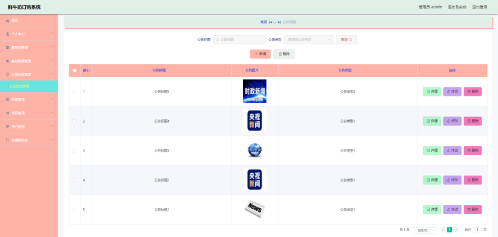
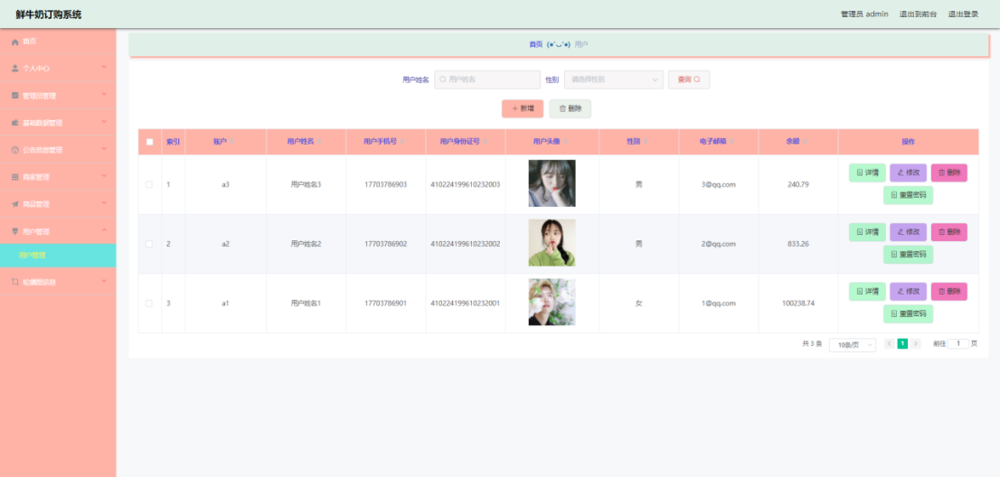
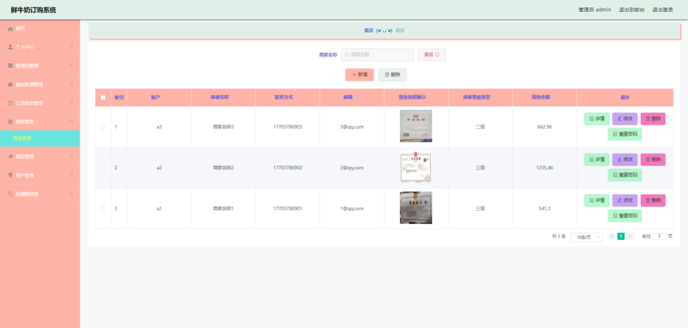
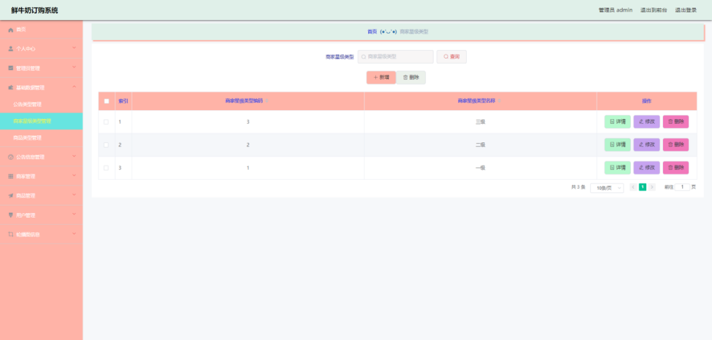
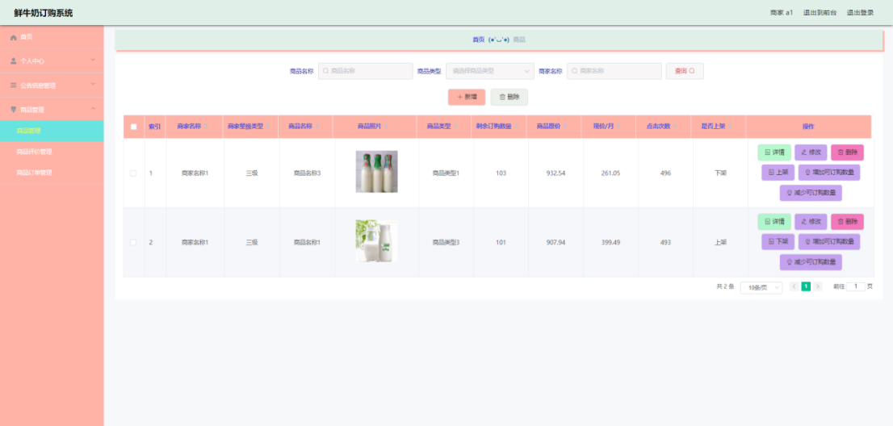
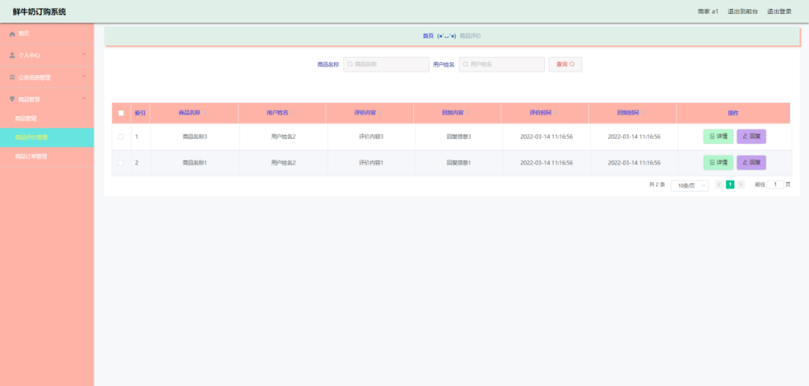
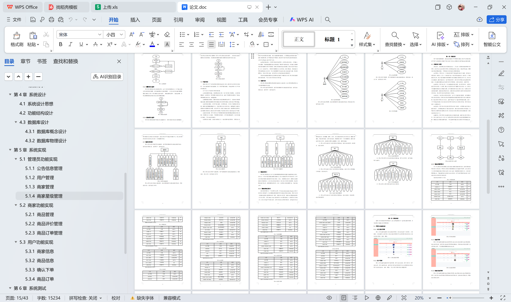

# springboot176-鲜牛奶订购系统的设计与实现

>  博主介绍：
>  Hey，我是程序员Chaers，一个专注于计算机领域的程序员
>  十年大厂程序员全栈开发‍ 日常分享项目经验 解决技术难题与技术推荐 承接各类网站设计，小程序开发，毕设等。
>  【计算机专业课程设计，毕业设计项目，Java，微信小程序，安卓APP都可以做，不仅仅是计算机专业，其它专业都可以】

## 3000套系统可挑选，获取链接：https://chaerspol.github.io/

<b>QQ【获取完整源码】：674456564</b>

<b>QQ群【获取完整源码】：1058861570</b>

### 系统架构

> 前端：html | js | css | jquery | vue
>
> 后端：springboot | mybatis
> 
> 环境：jdk1.8+ | mysql | maven

# 一、内容包括
包括有  项目源码+项目论文+数据库源码+答辩ppt+远程调试成功

# 二、运行环境

> jdk版本：1.8 及以上； ide工具：IDEA； 数据库: mysql5.7及以上；编程语言: Java

# 三、需求分析

**3.1 可行性分析**

从三个不同的角度来分析，确保开发成功的前提是有可行性分析，只有进行提前分析，符合程序开发流程才不至于开发过程的中断。

**3.1.1 技术可行性**

在技术实现层次，分析了好几种技术实现方法，并且都有对应的成功案例，也有很多开源模块可以进行参考，所以从技术可行性分析来讲，实现鲜牛奶订购系统是没有问题的。

**3.1.2 经济可行性**

对于身为学生的开发者而言，在经济资源上面可用者很少，为了开发鲜牛奶订购系统，通过开发软件对硬件的要求，发现自己的电脑是完全能用来开发的，并且学校机房的配置也可以达到要求。最重要的是选择的技术都可以在网上找到不花钱的教程以及资料，因为不花钱，所以经济方面是具有可行性的。

**3.1.3 操作可行性**

鲜牛奶订购系统的具体实现，本身参考人类的正常操作逻辑，把常用的操作习惯当做主要的导航实现，可以让使用者更快速的理解并且上手操作，实现符合逻辑的操作流程是操作可行性的具体体现。
以上就是从不同的角度来分析，确保了鲜牛奶订购系统的正常开展。

**3.2 系统流程**

鲜牛奶订购系统投入使用后，使用者如果能看到相应的流程操作图会提高程序的理解能力。
使用者在操作鲜牛奶订购系统中，应该按照本系统提供的操作流程（图3.1即为本系统的操作流程图）进行操作，可以减少操作失误，从而节省进入鲜牛奶订购系统的时间。

# 四、功能模块

下图即为设计的管理员功能结构，管理员权限操作的功能包括管理商家，管理商家星级信息，管理用户，管理商品等。

下图即为设计的商家功能结构，商家权限操作的功能包括管理商品，回复商品评价，管理商品订单等。

下图即为设计的用户功能结构，用户权限操作的功能包括查看商家，购买商品，提交订单，管理商品订单等。

# 五、效果图展示【部分效果图】

图5.1 公告信息管理界面【图5.1 即为编码实现的公告信息管理界面，公告信息包括了公告图片，公告类型，公告标题等，管理员在公告信息管理界面中可以对界面中显示的所有公告信息进行更改，查询，删除。】

图5.2 用户管理界面【图5.2 即为编码实现的用户管理界面，用户信息有性别，用户手机号，用户身份证号，用户头像等信息。管理员在用户管理界面中可以为本界面显示的所有用户信息进行查询，修改，删除，可以为用户的账号进行重置密码。】

图5.3 商家管理界面【图5.3 即为编码实现的商家管理界面，商家信息有营业执照，商家星级类型，商家名称等信息。管理员在商家管理界面中新增商家，更改商家的营业执照，商家星级信息等，可以删除需要删除的商家信息。】

图5.4 商家星级管理界面【图5.4 即为编码实现的商家星级管理界面，商家星级信息有商家星级类型名称等，管理员在商家星级管理界面修改商家星级信息，查询商家星级信息，删除商家星级信息等。】

图5.5 商品管理界面【图5.5 即为编码实现的商品管理界面，商品信息有商品是否上架，剩余订购数量，商品原价等信息，商家在商品管理界面中为商品的可订购数量进行增加，为商品的可订购数量进行减少，可以上架商品，下架商品以及更改商品信息等。】

图5.6 商品评价管理界面【图5.6 即为编码实现的商品评价管理界面，商家在商品评价管理界面中查看用户对商品的评价信息，商品的评价信息有评价内容，回复内容等，商家需要对商品评价进行回复。】

 <b>完整文章</b>
 
 
 

## 3000套系统可挑选，获取链接：https://chaerspol.github.io/

<b>QQ【获取完整源码】：674456564</b>

<b>QQ群【获取完整源码】：1058861570</b>

